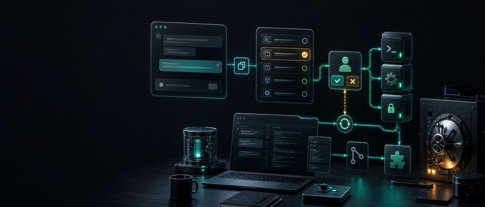

# Codex额度用完怎么办，用Handex让循环继续

摘要：一个白帽黑客的 Codex 和 OmniDoer 额度见底了。最近没有挖到漏洞，没有赏金收入，自动代理也暂时接不上本地工具链。于是他突发奇想：能不能用手工 Copy/Paste，把网页版免费对话 LLM 变成 Codex 的 fallback？Handex 就是把这个临时救急动作整理成一个 Human-in-the-Loop 工作台。

凌晨两点，终端还亮着。

一个白帽黑客盯着屏幕，手边是没跑完的测试、没整理完的报告、还有几个还没排除的可疑入口。过去几个月，他已经习惯了让 Codex 或 OmniDoer 接管这些细活：读仓库、拆任务、跑命令、看日志、改脚本、写说明。

但今天不行。

Codex 额度用完了，OmniDoer 的自动链路也暂时用不了。更糟的是，最近没有挖到新的漏洞，没有新的赏金入账，短期内也不想再给任何云端额度充值。

问题很具体：机器还在，项目还在，本地工具链还在，脑子里也还有下一步要验证的方向。只是那个能自动调用工具的 agent，突然不在了。

网页上倒是还有免费的对话 LLM 可以用。它们能推理，能读粘贴进去的上下文，能写代码片段，能分析报错。可它们看不到本地文件，也不能运行命令，更不能直接操作 Git。

于是一个有点笨、但很现实的念头冒了出来：

如果不让网页模型直接碰本地环境呢？

如果只让它提出下一步命令，由人复制到本地执行，再把输出粘回去呢？

如果这个 Copy/Paste 循环足够稳定，它是不是就能成为 Codex 额度用完后的手工 fallback？

Handex 就是从这个救急问题里长出来的。

<!-- 插入中文图 1：方形发布海报 -->

## 不是替代 Codex，而是让断掉的循环续上

全自动 agent 最顺手的地方，是它把一个工程循环串起来了：

1. 观察当前状态。
2. 判断下一步。
3. 调用本地工具。
4. 读取执行结果。
5. 继续判断。

额度用完后，真正断掉的不是模型能力，而是第三步和第四步之间的工具链路。网页 LLM 仍然可以思考，但它不能替你跑 `ls`、读文件、执行测试、检查 Git diff。

Handex 做的不是绕过额度，也不是伪装成另一个全自动 agent。

它做的是降级：把自动执行改成手工授权，把本地工具调用变成可审阅的 Copy/Paste 流程，让原本中断的工程循环继续运转。

这听起来没有“全自动”那么酷，但在紧急时刻，它解决的是更实际的问题：你不用因为额度耗尽而把任务彻底停掉，也不用退回到毫无上下文的零散聊天。

## Copy/Paste 也可以是一套协议

临时救急时，最危险的不是慢，而是乱。

你把一段报错贴给模型，模型回一堆建议；你自己挑一条命令跑了，又忘了把完整输出贴回去；过了十分钟，模型不知道哪些假设已经排除，你也忘了刚刚改过哪个文件。

这就是手工模式最容易崩的地方：上下文散了，执行边界也散了。

Handex 把这个过程收束成一个固定循环：

1. 你把 Handex 生成的任务提示复制到任意网页模型。
2. 网页模型只提出下一步工具命令。
3. 你在 Handex 里审阅这条命令。
4. 本地工具执行命令，并把结果返回。
5. 你再把结果交回模型，让它继续判断下一步。

也就是说，Copy/Paste 不再是临时凑合，而是一个有边界、有审阅、有上下文延续的应急协议。

模型负责判断，人负责授权，本地工具负责执行。

这个分工很笨拙，也很稳。

<!-- 插入中文图 2：X 横图卡片 -->

## 白帽场景里，边界比速度更重要

白帽黑客做漏洞研究时，最怕把方便当成安全。

仓库里可能有私有代码，日志里可能有敏感路径，环境里可能有凭据，报告里可能有还没披露的漏洞细节。把这些东西一股脑扔进网页聊天窗口，通常不是好主意。

Handex 的定位正好相反：它不鼓励模型越过边界。

它可以把任务上下文、工具结果、上传文件、技能说明、Vault 元数据、GitHub 桥接信息组织到一个工作台里；但真正的读取、执行、提交、推送，仍然在本地环境里发生，并且每一步都由人审阅。

这让 Handex 更像一套紧急手动控制台。

平时你当然可以继续用 Codex、OmniDoer 或其他自动 agent；当额度用完、网络不稳、服务排队、自动链路暂时不可用时，Handex 接住同一类工作流。

不是让模型拿走更多权限，而是在权限收紧的时候，让模型还能继续参与判断。

## 它适合什么人

如果你已经在用 AI coding agent，Handex 的价值会很直接。

当 Codex 或 OmniDoer 额度用完，但你还想继续推进任务时，它可以把网页版免费 LLM 接回本地工具链。

当你需要更谨慎地处理仓库、凭据、发布、服务器操作时，它可以把每一步执行都放到人工审阅之后。

当你在不同模型之间切换时，它可以提供一个稳定的任务外壳，让模型变成可替换的大脑，而不是把整个工作流绑死在某一个产品入口上。

Handex 不追求“完全无人值守”。它更关心一个现实问题：自动代理很好用，但自动代理总有断线的时候。断线之后，工程师能不能不丢上下文、不停任务、不把所有事情退回纯手工？

<!-- 插入中文图 3：竖版故事海报 -->

## 让循环继续，比假装全自动更重要

故事里的白帽黑客最后发现，这个办法并不神秘。

他只是在自动 agent 不可用时，把自己放回循环里：模型继续当大脑，人类临时当刹车和手，本地工具继续完成真实动作。

这套方式不如全自动快，也不应该被包装成全自动。

但它能让一个已经中断的开发循环继续跑下去。

对一个没有新漏洞收入、又不想停下手头工作的白帽来说，这就够重要了。因为真正值钱的不是“模型替你做完一切”的幻觉，而是在资源不够、额度见底、链路断开时，手里还有一套能工作的 fallback。

Handex 把这个 fallback 做成了一个工作台。

它把“复制、审阅、执行、返回”这四步固定下来，让网页模型可以参与工程判断，让本地工具继续行动，也让人始终守在关键操作之前。

这不是一个更花哨的聊天框。

这是 Codex 和 OmniDoer 额度耗尽时，给 AI 辅助开发准备的一套手工救急驾驶舱。

## 试用与源码

项目页面：https://omnidoer.github.io/handex/

GitHub：https://github.com/OmniDoer/Handex

Handex 已经公开发布。你可以从项目页面了解工作流，也可以直接查看源码，按自己的本地工具链和安全边界改造成适合团队使用的版本。
